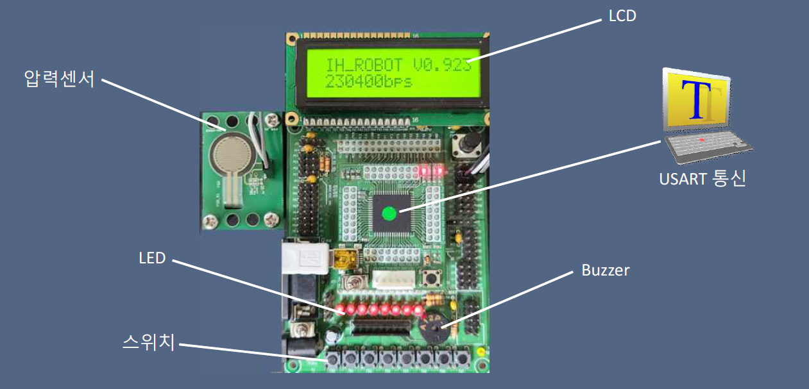
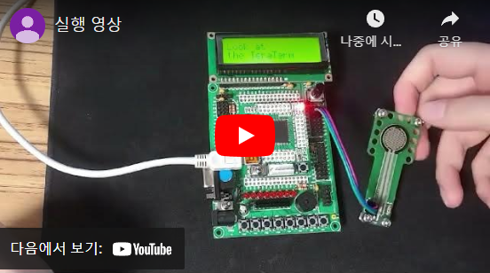

### 장애물 피하기 게임

- 압력센서를 통해 게임시작 가능
- 스위치를 통해 LCD에 나오는 물체 조종하여 장애물 피하기
- 부저와 LED를 통해 게임의 진행상황 표시

### 📚 사용 스택

**BackEnd** : 

- C

**Board** : 

- Atmega128

**Sensor :** 

- 압력센서

### 📋 수행한 역할

수행한 역할 : **팀장 및 총괄**(`게임 코드 작성`, `HW 연결 및 테스트`)

프로젝트에서 `80%` 정도의 기능 구현을 하였습니다.

- Atmega128에 부착된 센서들을 원하는 작동이 가능토록 환경설정
- LCD에 보여지는 게임을 구현

### 🎡 기능 소개

- 압력 센서를 통해 게임이 시작되면 스위치를 통해 LCD의 게임 조작 가능

### 🚀 배운점 & 보완점

**배운점**

1. 헤더 파일과 메인 파일을 사용할 수 있음
2. Atmega128의 센서들을 사용하기 위한 환경 세팅

**보완점**

1. 게임을 수동 코딩하여 항상 같은 게임을 즐길 수 있습니다. 코딩 실력 보완을 통해 더 재밌는 게임 구현을 할 수 있다.
2. 더 많은 센서들을 부착하여 게임을 더 흥미롭게 할 수 있다